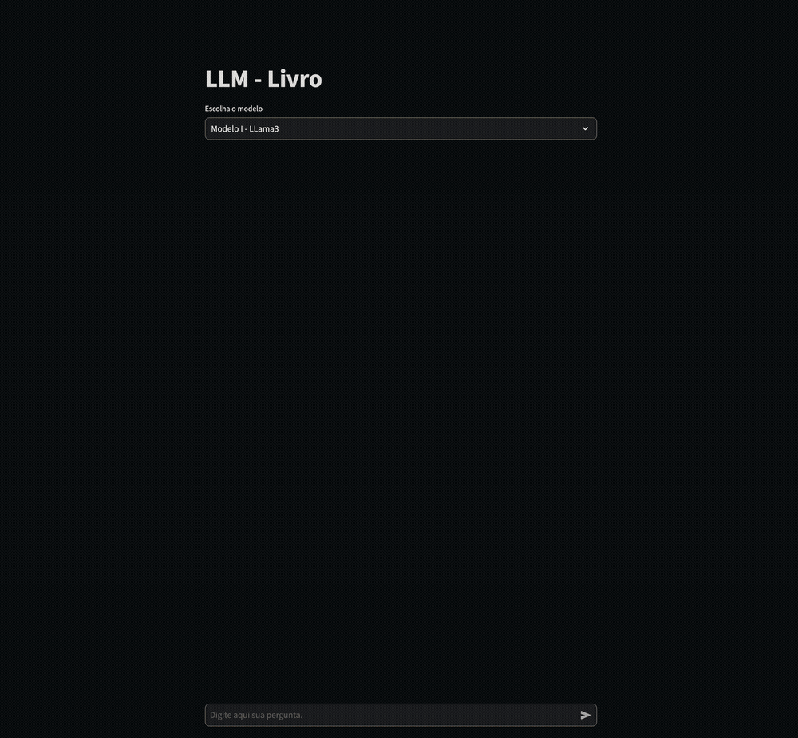

# Projeto de Chatbot com oLLama, Streamlit e LangChain

Este projeto é uma aplicação de chatbot que utiliza o modelo LLaMA (LLaMA:8B) integrado com Streamlit para a interface web e LangChain para a manipulação de cadeias de linguagem. Para o embedding estamos utilizando o modelo `nomic-embed-text`.

## DEMO
 

## Instalação
`pip install -r requirements.txt`

## Execução
`ollama run llama3:8b`

`streamlit run src/app.py`